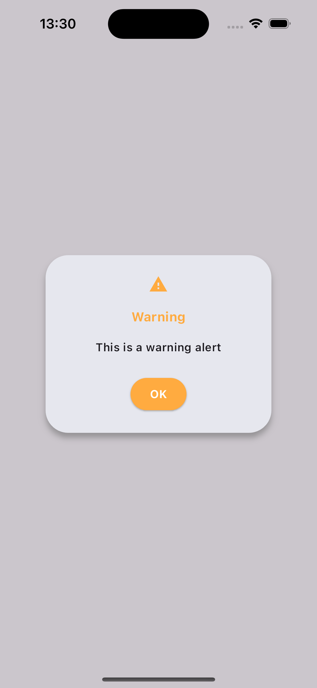

# Steel Alert

Steel alert is a UI Kit for Alert or Dilaogs. It comes with 3 types info, error and warning.

## Preview

### Success


### Error


### Warning



## Getting started

Add the dependency in `pubspec.yaml`

```yaml
dependencies:
  steel_alert: ^0.0.3+2
```

## Usage

Firstly import the package

```dart

import 'package:steel_alert/steel_alert.dart';

```

After that you need to define navigator key.

```dart

void main() {
  runApp(
    MaterialApp(
      navigatorKey: Steel.navigationKey,
      home: const MyApp(),
      debugShowCheckedModeBanner: false,
    ),
  );
}

```

Here is how you can call dialog in your project.

```dart

ElevatedButton(
              onPressed: () {
                SteelAlert.success(
                  title: 'Success',
                  message: 'This is a success alert',
                );
              },
              child: const Text("Show Success Alert"),
            ),

```

We have 3 types for a now.

- SteelAlert.success()
- SteelAlert.error()
- SteelAlert.warning()

## Feedback

Please feel free to [give me any feedback or file issue](https://github.com/melihcelik09/steel_alert/issues) helping support this plugin!
